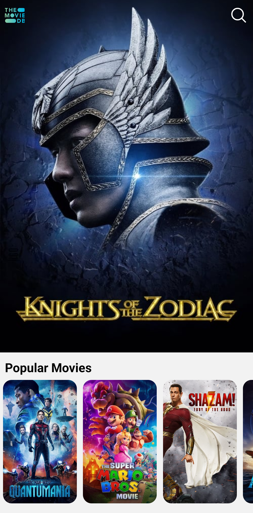
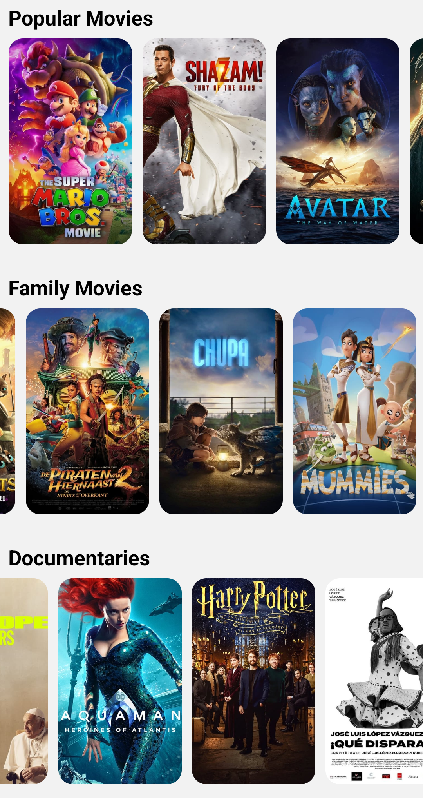
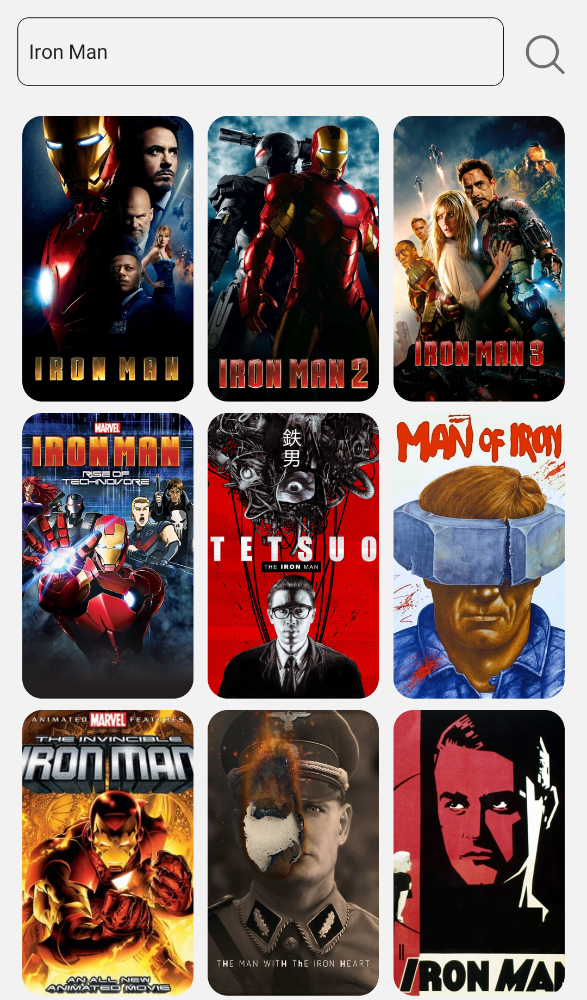
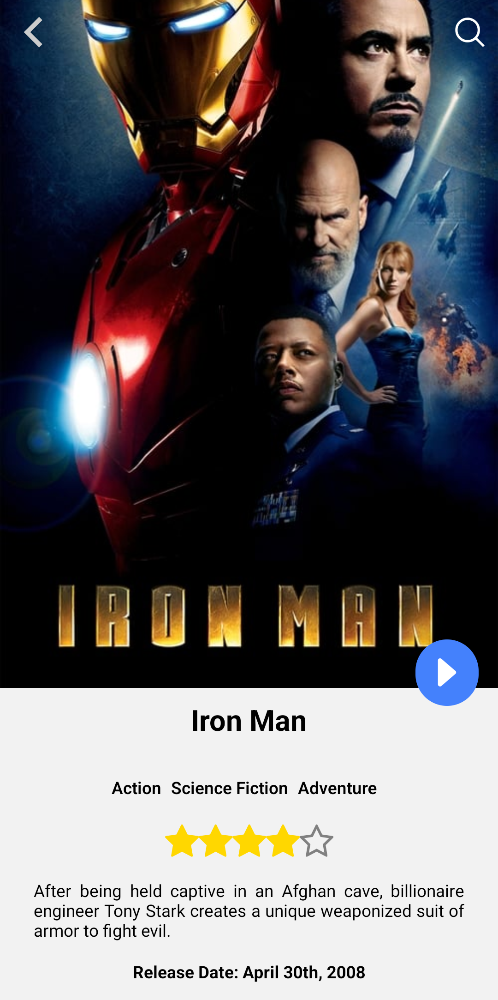
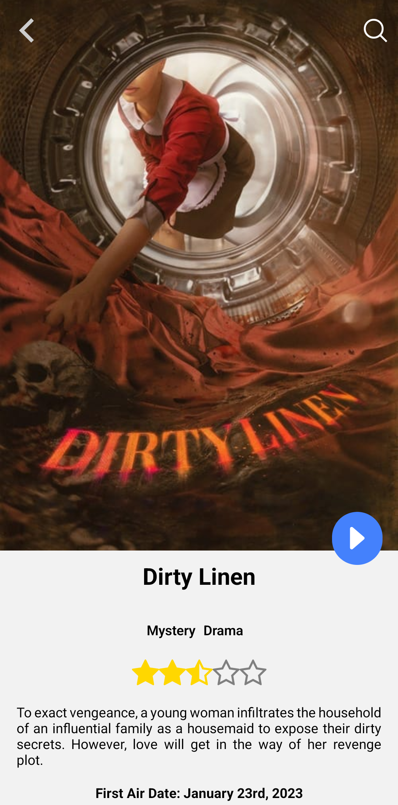
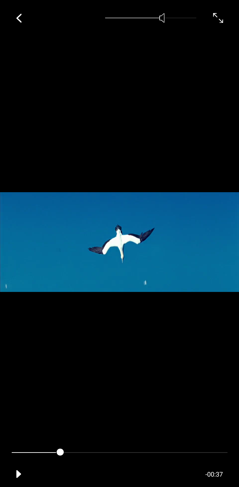
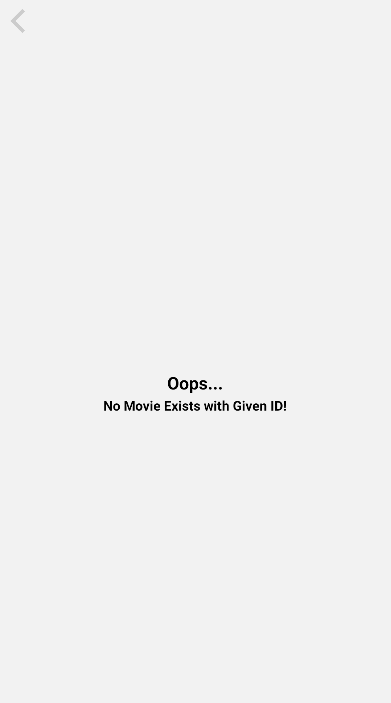
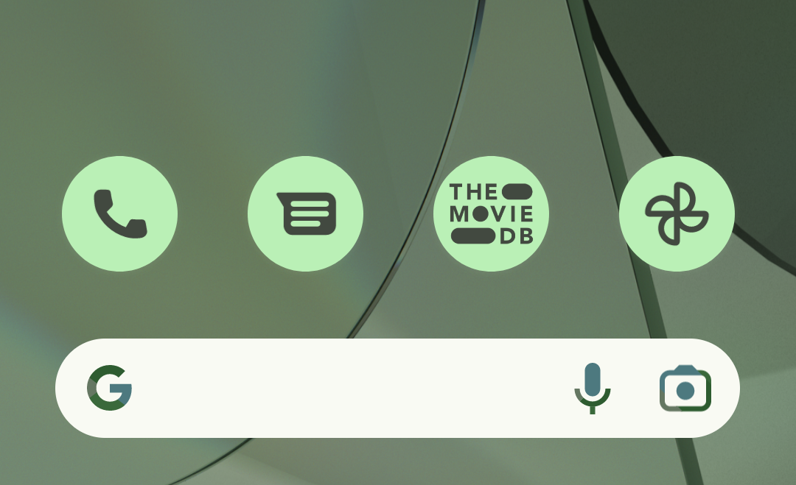

# TMDB

This is a repository for TMDB app that show popular, upcoming Movies & TV shows made with React Native, TypeScript, TailWindCSS, The Movie DB API, & React Navigation.

Funcionalities:

- HomePage Carousel Shows Upcoming Movies.
- Swipe Left/Right to View More Movies/Shows.
- Click on Movie / TV card to goto Details Page.
- Navigate back by cliking on Back Button on Header.
- Click on Magnifying 🔍 Icon to Navigate to Search Page.
- Type Movie / TV name to Search & click on Card to goto Details Page.
- Press on Play Button to Open Video Player Modal & Play a Video.
- Project is complete TypeSafe with proper Type Declaration.

### Prerequisites

**Node ^= 16**

**Android Studio / XCode (Virtual Device Simulation)**

**VS Code (IDE)**

### Cloning the repository

```shell
git clone https://github.com/nayak-nirmalya/tmdb_app_react_native.git
```

## Running Project

To run your project, connect your physical device via usb and turn on USB Debuggin or start Android Virtual Device, then navigate to the root directory and run one of the following npm commands:

```shell
cd uber-clone
npm run android
npm run ios
npm run start
```

To Build APK File, Run:

```shell
cd android
./gradlew assembleRelease
```

Android Build APK can be found at: `android\app\build\outputs\apk\release\app-release.apk`

Android Build APK for this Project: `build_files\TMDB.apk`

## Screenshots

<div align='center'>

### Home Screen



### Home Screen Categories



### Search Result



### Movie Details Screen



### TV Details Screen



### Video Player Modal



### Error Screen



### App Icon


### Material You Icon



</div>
